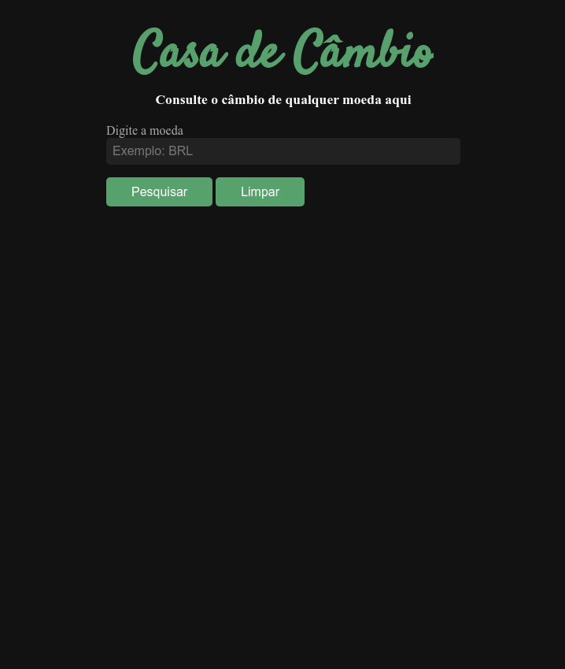

# PROJETO CASA DE CÂMBIO 💰

- O objetivo foi criar um conversor de moedas, de acordo com o câmbio atual, consumindo uma Api usando o fetch e renderizando as moedas

- Utilizamos HTML, CSS e JAVASCRIPT usando o fetch para consumir os dados das moedas e criar uma lista para ser renderizada de acordo com a moeda escolhida.
  

  

**[ABRIR PROJETO NO NAVEGADOR](https://andrehorman1994.github.io/PROJECT-09-CASA-CAMBIO/)**

---

# TECNOLOGIAS UTILIZADAS 💻

- **HTML**
- **CSS**
- **JAVASCRIPT**
- **FETCH**
- **API**
    

---

# INSTRUÇÕES IMPORTANTES 📝

## COMO BAIXAR O PROJETO:

1. Clone o repositório:
   - **`git clone git@github.com:ANDREHORMAN1994/PROJECT-09-CASA-CAMBIO.git`**
2. Entre na pasta do repositório que você acabou de clonar:
   - **`cd PROJECT-09-CASA-CAMBIO`**
       

## COMO RODAR O PROJETO:

1. Baixe a Extensão Live Server:
   - Clique no ícone **`Extensions`** do Vs Code ou use o atalho **`CTRL + SHIFT + X`**
   - Digite no campo de busca **`Live Server`**
   - Instale a extensão
   - Abra o arquivo **`index.html`** \* Clique no botão **`“Go Live”`** no canto inferior do Vs Code ou Execute o comando **`ALT + L ALT + O`** para abrir com o Live Server.
       

---

# VQV 🚀
